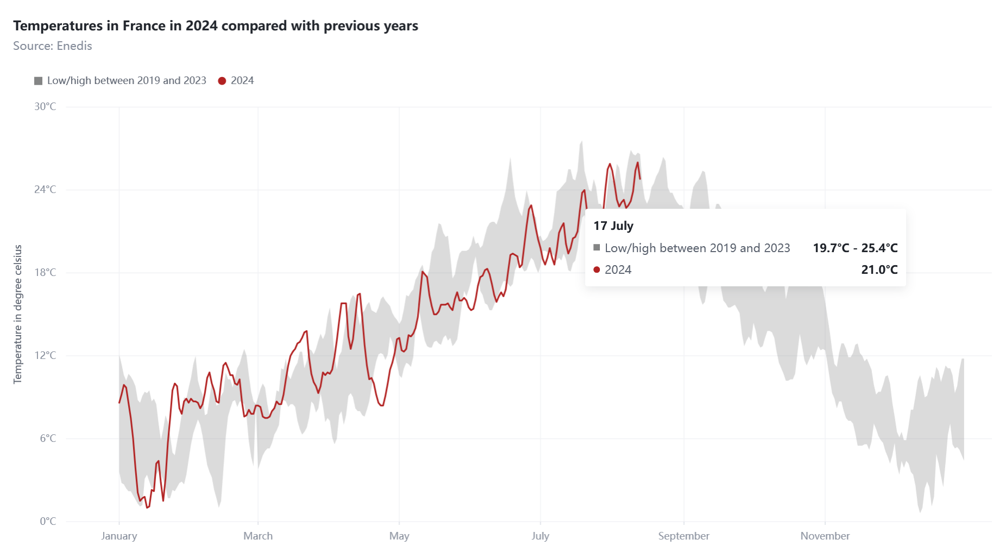

# vchartr

> R Htmlwidget for [VChart](https://github.com/VisActor/VChart) : VChart is a charting component library in VisActor visualization system. See the [online documentation](https://www.visactor.io/vchart) for examples.

<!-- badges: start -->
[](https://CRAN.R-project.org/package=vchartr)
[](https://lifecycle.r-lib.org/articles/stages.html#experimental)
[](https://github.com/dreamRs/vchartr/actions/workflows/R-CMD-check.yaml)
<!-- badges: end -->


## Installation

You can install the development version of vchartr from [GitHub](https://github.com/dreamRs/vchartr) with:

```r
# install.packages("remotes")
remotes::install_github("dreamRs/vchartr")
```

## Examples

A scatter plot with [palmerpenguins](https://allisonhorst.github.io/palmerpenguins/) dataset and inspired from the documentation:


```r
library(vchartr)
library(palmerpenguins)
vchart(penguins) %>% 
  v_scatter(
    aes(
      x = bill_length_mm,
      y = bill_depth_mm,
      color = species, 
      shape = species
    )
  ) %>%
  v_smooth(
    aes(
      x = bill_length_mm,
      y = bill_depth_mm,
      color = species
    ),
    method = "lm",
    se = FALSE
  ) %>% 
  v_scale_x_continuous(
    name = "Bill length (mm)"
  ) %>% 
  v_scale_y_continuous(
    name = "Bill depth (mm)"
  ) %>% 
  v_labs(
    title = "Penguin bill dimensions",
    subtitle = "Bill length and depth for Adelie, Chinstrap and Gentoo Penguins at Palmer Station LTER"
  ) %>% 
  v_specs_legend(
    orient = "top",
    position = "start",
    layout = "vertical",
    layoutType = "absolute",
    right = 0,
    bottom = 40,
    title = list(
      visible = TRUE,
      text = "Penguin species"
    )
  )
```


A line chart with area range:




```r
vchart(temperatures, aes(date)) %>% 
  v_area(
    aes(ymin = low, ymax = high),
    area = list(style = list(fill = "#848585", fillOpacity = 0.3)),
    name = "Low/high between 2019 and 2023"
  ) %>% 
  v_line(
    aes(y = `2024`), 
    line = list(style = list(stroke = "firebrick")),
  ) %>%
  v_scale_x_date(
    date_breaks = "2 months", 
    date_labels = "MMMM",
    date_labels_tooltip = "DD MMMM"
  ) %>% 
  v_scale_y_continuous(
    name = "Temperature in degree celsius",
    labels = format_num_d3(".0f", suffix = "°C"),
    labels_tooltip = format_num_d3(".3r", suffix = "°C")
  ) %>% 
  v_labs(
    title = "Temperatures in France in 2024 compared with previous years",
    subtitle = "Source: Enedis"
  ) %>% 
  v_specs_legend(
    visible = TRUE,
    orient = "top",
    position = "left"
  )
```


## Development

This package use [{packer}](https://github.com/JohnCoene/packer) to manage JavaScript assets, see packer's [documentation](https://packer.john-coene.com/#/) for more.

Install nodes modules with:

```r
packer::npm_install()
```

Modify `srcjs/widgets/vchart.js`, then run:

```r
packer::bundle()
```

Re-install R package and try `vchart()` function.


