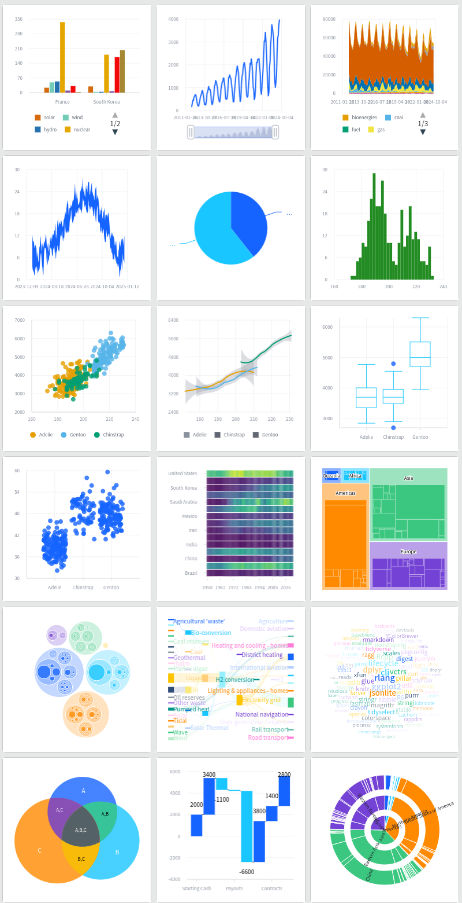

# vchartr

``` r
library(vchartr)
```

## Installation

You can install the development version of vchartr from
[GitHub](https://github.com/dreamRs/vchartr) with:

``` r
# install.packages("remotes")
remotes::install_github("dreamRs/vchartr")
```

## Overview

The following graphs (and more) can be produced:



charts-overview

See the [JavaScript library website](https://www.visactor.io/vchart) for
more examples and documentation.

Interactive examples are available here:
<https://dreamrs.github.io/vchartr/articles/charts.html>.

## Usage

Start by initializing a chart with the
[`vchart()`](https://dreamrs.github.io/vchartr/reference/vchart.md)
function, then choose the appropriate function according to the type of
chart you wish to make and specify the variables to be used as
aesthetics:

``` r
vchart(eco2mix) %>% 
  v_line(aes(date, solar))
```


v_line

Modify scales options for aesthetics with `v_scale_*` functions:

``` r
vchart(eco2mix) %>% 
  v_line(aes(date, solar)) %>% 
  v_scale_x_date(
    date_breaks = "2 years",
    date_labels = "MM-YYYY",
    name = "Date"
  ) %>% 
  v_scale_y_continuous(
    labels = "~s", 
    name = "Electricity generation"
  )
```


v_scales

Set any options with `v_specs` (see all options available
[here](https://www.visactor.io/vchart/option/lineChart)):

``` r
vchart(eco2mix) %>% 
  v_line(aes(date, solar)) %>% 
  v_specs(
    brush = list(
      brushType = "x",
      zoomAfterBrush = TRUE
    ),
    dataZoom = list(
      orient = "bottom",
      startText = list(formatter = "{label:%Y-%m-%d}"),
      endText = list(formatter = "{label:%Y-%m-%d}")
    )
  )
```


v_specs

Or use `v_specs_*` helpers:

``` r
vchart(eco2mix) %>% 
  v_line(aes(date, solar)) %>% 
  v_specs_datazoom(
    start = "{label:%Y-%m-%d}",
    end = "{label:%Y-%m-%d}",
    brush = TRUE
  )
```
