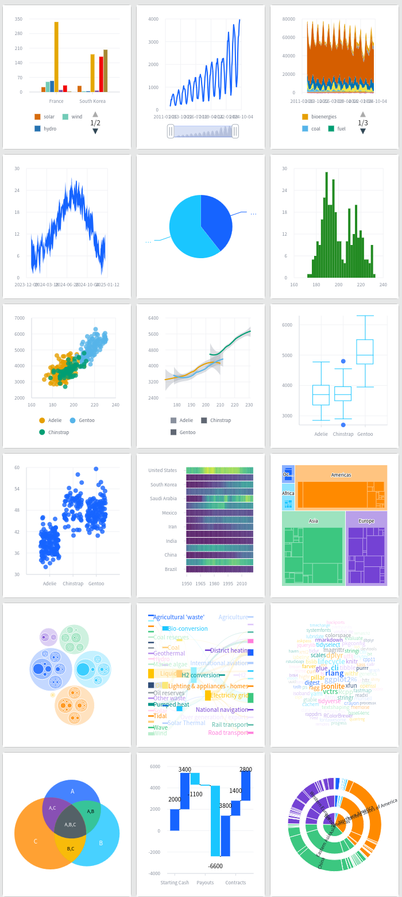

```{r, include = FALSE}
knitr::opts_chunk$set(
  collapse = TRUE,
  comment = "#>"
)
```

```{r setup}
library(vchartr)
```


## Installation

You can install the development version of vchartr from [GitHub](https://github.com/dreamRs/vchartr) with:

```r
# install.packages("remotes")
remotes::install_github("dreamRs/vchartr")
```


## Overview

The following graphs (and more) can be produced:




## Usage

Start by initializing a chart with the `vchart()` function, then choose the appropriate function according to the type of chart you wish to make and specify the variables to be used as aesthetics:

```r
vchart(eco2mix) %>% 
  v_line(aes(date, solar))
```


